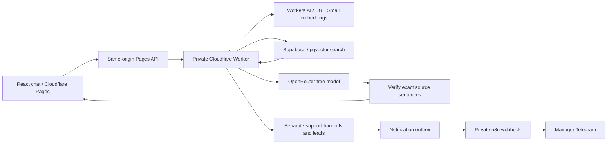

# AI Customer Support Agent

A live, knowledge-grounded support portfolio demo for fictional store **Northline**.

- Live: https://ai-support-rag-demo.pages.dev/
- Repository: https://github.com/ScorpionD/ai-support-rag-demo
- React + TypeScript + Vite, Cloudflare Pages / private Worker, Supabase PostgreSQL + pgvector, OpenRouter free LLM and an independent n8n Telegram workflow.

## What works

Questions are embedded, searched against company documents and answered with verified source quotes. Unknown questions and uncertain matches offer human review. A free-model outage returns related sources without claiming an AI answer. Sources open in the interface or as standalone source pages. Chat history is restored from the backend using an anonymous secure session cookie. Support handoffs and sales leads are stored in separate tables and notify the demo manager through n8n.

The public demo uses fictional details only. It is a working demonstration of production patterns, not a staffed support service or a production SLA.

## Architecture



The Worker is accessible through a Pages service binding; workers.dev and preview URLs are disabled. No database key, AI key, bot token or ingestion token is shipped to the browser. The existing lead automation project and cryptoanalyze.pro are not dependencies of the application. The RAG notification workflow shares the existing n8n runtime and private network connection without modifying the original workflow.

## Retrieval and answer safety

- Embeddings: `@cf/baai/bge-small-en-v1.5`, 384 dimensions, mean pooling; documents and queries use the same model/pooling. English demo KB.
- PostgreSQL cosine similarity, top 4 chunks. Calibrated demo source threshold: 0.66; weak matches become **Human review needed**, absent matches become **Not covered**. Similarity is a search signal, not a calibrated probability of correctness.
- The LLM selects sentence IDs from retrieved chunks. The server assembles the stored text verbatim; it never trusts model-rewritten quotes. The server rejects unknown chunk IDs, altered quotes, partial sentences and invalid JSON. The interface shows only validated source text. This is deliberately extractive RAG; it does not let the LLM add uncited prose.
- Context is treated as data, not instructions. Private account actions and prompt override requests cannot receive a confirmed policy answer.
- OpenRouter requests are limited to `:free` or `openrouter/free`, with provider maximum prices set to zero. Default model: `nex-agi/nex-n2.5-mini:free`; reasoning is disabled for this short extraction task. Change the environment variable to another free model when needed.
- A 7-second embedding timeout, 12-second LLM timeout, unavailable model, daily quota or failed verification yields sources-only fallback and human review. No paid OpenAI API is used.
- Identical normalized questions within a session and KB revision reuse the stored answer. Database leases and atomic completion prevent duplicate message pairs and duplicate LLM calls for concurrent submissions. Temporary provider-failure answers can be retried after two minutes; the existing message pair is updated, without adding duplicates.

Exact quotation prevents fabricated policy text but cannot prove relevance or completeness in every case. Review company content and expand evaluation cases before using this for real customers.

## Ingestion: FAQ and Markdown

The `knowledge/northline-faq.json` seed contains 10 curated fictional articles. Each document has `id`, `title`, `content`, optional `question`, `category` and HTTPS `url`. Without a URL, the source opens at `/api/sources/<id>`.

```sh
# Set RAG_ADMIN_TOKEN privately in your shell first; never paste it into Git.
npm run ingest -- knowledge/northline-faq.json
npm run ingest -- knowledge/your-policy.md
```

Markdown uses its filename as ID and its first H1 as title. The authenticated ingestion endpoint chunks text (up to 1,000 characters with 140-character overlap), generates embeddings and replaces that document's chunks atomically. Content revisions invalidate question caches; re-ingesting unchanged content does no extra embedding work. Documents are limited to 40,000 characters. Source URLs are references, never fetched by the backend.

PDF is deliberately not included: convert it to reviewed Markdown, then ingest it. This avoids unreliable PDF extraction and extra infrastructure in this stage.

## Local development

Node.js 22.12 or newer:

```sh
npm ci
# Copy .env.example to .env and keep VITE_SUPPORT_MODE=mock locally.
npm run dev
npm test
npm run build
```

Local mock mode remains available without credentials. Live production is explicitly configured with `VITE_SUPPORT_MODE=live`. A disconnected live backend returns an error; it never silently pretends that a local answer was stored or delivered.

## Database setup

Create a separate Supabase Free project and run both SQL files in `supabase/migrations/` in numeric order in its SQL editor. It enables pgvector and creates documents, chunks, sessions, turns/messages, separate handoffs and leads, an outbox and usage counters. All tables have RLS enabled, with no anonymous or authenticated table access. RPCs are restricted to the backend service role.

Anonymous sessions use 256-bit random HttpOnly, Secure, SameSite=Strict cookies. Only a peppered hash is stored in the database. History, contacts and notification payloads expire after seven days; an hourly Worker job cleans them up. There is no cross-device login or account recovery.

## Cloudflare deployment

Pages Git integration:

- Production branch: `main`
- Build command: `npm run build`
- Output: `dist`
- Production environment: `VITE_SUPPORT_MODE=live`
- Production service binding: `RAG_API` -> `ai-support-rag-api`
- Fail open: false for production and preview

Deploy the separate Worker using `npm run deploy:backend`. Its configuration is in `worker/wrangler.jsonc`; adapt the private VPC binding for a different account. Set these as encrypted Worker secrets: `SUPABASE_URL`, `SUPABASE_SECRET_KEY`, `OPENROUTER_API_KEY`, `SESSION_PEPPER`, `RAG_ADMIN_TOKEN`, `RAG_NOTIFICATION_SECRET`. The only `VITE_*` value is the public mode switch. Worker changes require an explicit deployment; Pages Git builds deploy the frontend and API proxy.

After deployment, ingest the FAQ seed. Production origin checks intentionally reject browser writes from other sites and preview deployments.

## n8n and delivery reliability

`n8n/workflow.mjs` builds the separate notification workflow. Supply the new RAG database credential, a header-auth credential, Telegram bot credential and manager chat ID privately at setup time. Do not commit n8n credential exports.

The backend saves a request and outbox row in one transaction before calling n8n through the private VPC service. The workflow atomically claims the row, sends Telegram and records the Telegram message ID. The UI reports delivered only when that database status confirms delivery. Duplicate form submissions reuse the same request and do not resend successful notifications.

Safe database operations retry once. Pending outbox entries are retried by the hourly Worker job after an unavailable n8n trigger. A Telegram send with an ambiguous result is marked for review, not blindly retried; this avoids duplicate manager alerts. A stuck sending state becomes review after ten minutes on the next hourly cleanup. There is no claim of exactly-once delivery across Telegram and PostgreSQL. Review notifications that need attention in Supabase.

## Abuse protection and free-tier limits

- Edge rate limit: 30 API requests/minute/IP.
- Questions: 800 characters, 8/minute/session, 20 distinct questions/session.
- New sessions: 10/hour/IP and 500/day globally.
- Contacts: explicit consent, 4/hour/IP and 25/day globally; messages up to 1,000 characters.
- JSON request size caps, origin validation, private service binding, restrictive frontend CSP.
- RAG LLM budget: 20 requests/day; query embedding budget: 200/day. Limits stop calls; they do not upgrade plans. OpenRouter's account-wide quota is also shared with other projects.
- Logs contain operation/status/latency IDs, not chat text, email, tokens or contact details. n8n does not persist execution payloads.

Cloudflare Workers AI includes a daily free allocation; this small demo's BGE embeddings fit within that allocation. Supabase Free and OpenRouter free models have availability and quota limits. The application uses honest fallback when a dependency is unavailable. No paid service was requested or configured.

References: [BGE model](https://developers.cloudflare.com/workers-ai/models/bge-small-en-v1.5/), [Workers AI quotas](https://developers.cloudflare.com/workers-ai/platform/pricing/), [OpenRouter free router](https://openrouter.ai/docs/guides/routing/routers/free-router), [Supabase vector columns](https://supabase.com/docs/guides/ai/vector-columns).

## Verification

`npm test` exercises source matching, low confidence, unknown questions, exact citations, malformed LLM output, input/consent validation, chunking, rate limits, origin protection, local fallback and cancellation. Production checks additionally cover actual vector retrieval, an OpenRouter answer, persistence, repeat-question deduplication, source pages, separate handoff/lead storage and n8n Telegram delivery. Final measured results are recorded in `docs/verification.md`. The optional `node scripts/verify-database.mjs` check uses private Supabase environment variables to verify real transaction concurrency and fallback recovery; it cleans up its own synthetic session.
